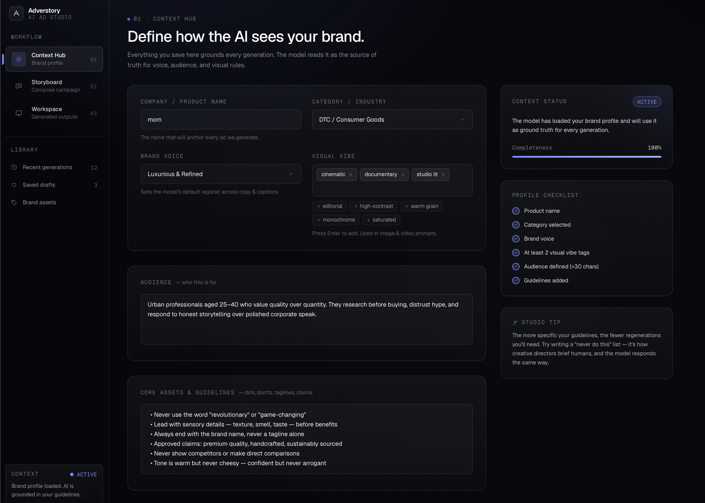
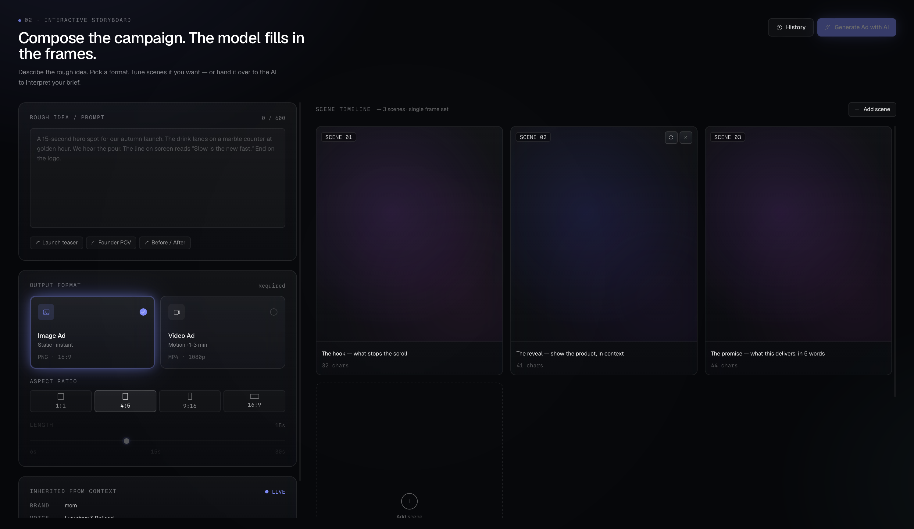

# Adverstory

AI-powered ad creation studio. Describe your brand, write a rough idea, and Adverstory generates a full storyboard and produces either a photorealistic image ad or a real AI-generated video ad — no editing software required.





---

## How it works

Adverstory is a single-page studio with three views:

### 1. Context Hub
Set up your brand profile once — company name, category, tone, vibes, target audience, and creative guidelines. Saved to localStorage so it persists across sessions and informs every generation.

### 2. Storyboard
Type a rough campaign idea (one sentence is enough). Gemini 2.5 Flash reads your brand profile and expands the idea into a scene-by-scene storyboard. Each scene has a visual description and narration. You can edit any scene before generating.

Pick your output format:
- **Image ad** — single photorealistic image composed from all scene descriptions
- **Video ad** — real AI-generated video (not a slideshow), choose aspect ratio and duration

### 3. Workspace
Results appear here. Image ads are immediate. Video ads use an async submit → poll pattern — Veo returns an operation name, the client polls every 10 seconds, and the video streams in once ready. Both formats can be downloaded directly.

---

## AI models

| Task | Model | Notes |
|------|-------|-------|
| Storyboard generation | `gemini-2.5-flash` | JSON mode, structured scene array |
| Image ads | `imagen-3.0-fast-generate-001` | All scenes composed into one prompt |
| Video ads | `veo-2.0-generate-001` | Async job, 5–8s, real video generation |

All AI calls run server-side only via Next.js API routes. Google Application Default Credentials (ADC) handle auth — no API keys in the codebase.

---

## Video generation deep dive

Veo generation is async and takes 2–5 minutes. The flow:

```
1. POST /api/video/generate
   → builds prompt from brand profile + scenes
   → submits job to Veo via @google/genai SDK
   → returns { operationName }

2. Client polls GET /api/video/status?operation=<name> every 10s
   → checks operation status server-side
   → returns { done: boolean, videoGcsUri?: string }

3. When done, client calls GET /api/video/download?uri=<gcsUri>
   → server fetches bytes from GCS via @google-cloud/storage
   → streams as video/mp4 to browser
   (browsers can't access gs:// URIs directly)
```

The video prompt is constructed from your brand profile (company, tone, audience) plus each scene's visual description and narration, stitched into a single cinematic brief.

---

## Tech stack

- **Framework**: Next.js 16 (App Router), TypeScript
- **Styling**: Tailwind CSS v4, custom glass-morphism design system
- **AI**: Google Vertex AI via `@google/genai` SDK
- **Storage**: `@google-cloud/storage` for GCS video proxy
- **State**: Zustand (storyboard editing)
- **Auth**: Google ADC (`gcloud auth application-default login`)

---

## Setup

### Prerequisites
- Node.js 20+
- Google Cloud project with Vertex AI API enabled
- `gcloud auth application-default login` run locally

### Enable APIs
```bash
gcloud services enable aiplatform.googleapis.com --project=YOUR_PROJECT_ID
```

### Environment
Create `.env.local`:
```
GOOGLE_CLOUD_PROJECT=your-project-id
GOOGLE_CLOUD_LOCATION=us-central1
```

> Veo is only available in `us-central1`. Don't change the region.

### Install and run
```bash
npm install
npm run dev
```

Open [http://localhost:3000](http://localhost:3000) — it redirects to `/studio`.

---

## Project structure

```
src/
├── app/
│   ├── studio/page.tsx              # main SPA shell (3 views)
│   └── api/
│       ├── storyboard/route.ts      # Gemini → scenes JSON
│       ├── image/route.ts           # Imagen → base64 data URL
│       └── video/
│           ├── generate/route.ts    # submit Veo job → operationName
│           ├── status/route.ts      # poll Veo operation
│           └── download/route.ts    # proxy GCS bytes as MP4
├── components/
│   ├── shell/Sidebar.tsx
│   └── views/
│       ├── ContextHub.tsx
│       ├── StoryboardView.tsx
│       └── WorkspaceView.tsx
└── lib/
    ├── ai/
    │   ├── client.ts                # GoogleGenAI instance (server-only)
    │   ├── gemini.ts                # generateStoryboard()
    │   ├── imagen.ts                # generateImage()
    │   └── veo.ts                   # submitVideoJob(), pollVideoJob()
    └── prompts.ts                   # all prompt templates
```

---

## Future ideas

- **Multi-image storyboard** — generate a separate Imagen image per scene, displayed as a visual storyboard before video generation
- **Brand kit uploads** — let users upload a logo or product image and reference it in generation via Gemini's image understanding
- **Campaign history** — save past generations to a backend (Firestore or Supabase) so you can revisit and regenerate
- **Veo 3 upgrade** — Veo 3 supports longer durations and higher fidelity; drop-in replacement once available in the SDK
- **Aspect ratio per scene** — different crops for different placements (feed, story, banner)
- **Export pack** — download all formats (1:1, 9:16, 16:9) in one zip for multi-platform campaigns
- **Team sharing** — shareable links to generated ads with view-only access
